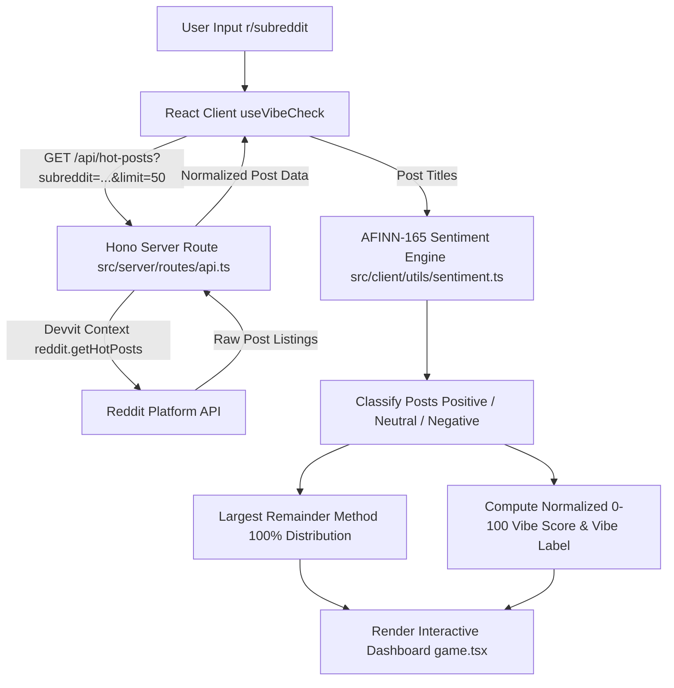

# 🔴 The Subreddit Vibe Check

An interactive Reddit Devvit Web application that analyzes the sentiment of a community's latest 50 HOT posts and presents the results through an interactive sentiment analytics dashboard.

The user enters a public subreddit, the server retrieves up to 50 HOT posts through Reddit's official API via Devvit, and the client analyzes the post titles using AFINN-165 to generate sentiment classifications, distribution percentages, and an overall Vibe Score.

---

## 🚀 Features

- 🔍 **Subreddit Search:** Flexible search for any public subreddit.
- ⚡ **Flexible Input Handling:** Full support for both plain name (`technology`) and prefixed (`r/technology`) inputs.
- 💡 **Quick Subreddit Suggestions:** One-click instant analysis buttons for popular communities.
- 📡 **Official Reddit HOT Post Retrieval:** Server-side fetching of up to 50 HOT posts using Reddit's authenticated Devvit API.
- 🧠 **Client-Side AFINN-165 Sentiment Analysis:** Real-time lexical sentiment scoring performed 100% inside the browser.
- 🏷️ **Three-Tier Sentiment Classification:** Automatic categorization into **Positive**, **Neutral**, and **Negative** states based on comparative scores.
- 📊 **Deterministic 100% Distribution:** Uses the Largest Remainder Method (Hare-Niemeyer) so distribution percentages always sum to exactly 100%.
- 🎯 **Overall 0–100 Vibe Score:** Normalized score reflecting the collective tone of the analyzed posts.
- 🏷️ **Vibe Label:** Dynamic community label (**Positive**, **Neutral**, or **Negative**) derived from the Vibe Score.
- 🎴 **Individual Post Sentiment Cards:** Detailed breakdown for every post, displaying title, sentiment badge, upvotes, comment count, author, relative timestamp, and Reddit link.
- ⏳ **Loading States:** Elegant loading skeleton UI during API fetches.
- ⚠️ **Error States:** Informative error cards for invalid names, private/non-existent subreddits, empty feeds, or network failures.
- 📱 **Responsive UI:** Dynamic layout optimized across desktop, tablet, and mobile views.
- ♿ **Accessibility Improvements:** Semantic HTML markup, keyboard accessibility, high contrast color coding, and ARIA labels.
- 🎨 **Dark Premium Visual Design:** Sleek modern aesthetics featuring dark gradients and responsive micro-animations.

---

## 🛠️ How It Works

The architecture follows a decoupled flow where server-side operations interact with Reddit's backend APIs while sentiment computations are executed client-side inside the iframe sandbox:



### Key Execution Highlights

- **Server-Side Reddit API Access:** Handled securely via Devvit's Node.js environment (`@devvit/web/server`).
- **Client-Side Sentiment Engine:** Executed entirely inside the React iframe browser context (`src/client/utils/sentiment.ts`).
- **No External AI Service:** Sentiment analysis requires zero external API keys, machine learning models, or LLM endpoints.
- **Title-Based Analysis:** Post **TITLES** are the single source of input for sentiment calculation.

---

## 🏗️ Architecture

### Client (`src/client`)

A React 19 + TypeScript dashboard rendered inside the Devvit Web iframe sandbox:

- **`splash.html` / `splash.tsx`:** The initial lightweight inline view entry point displayed in the Reddit feed. Provides a quick CTA to launch the main app.
- **`game.html` / `game.tsx`:** The full expanded dashboard view rendering the search interface, vibe metrics, charts, and post breakdowns.
- **`hooks/useVibeCheck.ts`:** Custom React hook orchestrating API request lifecycle, loading/error state management, and triggering sentiment analysis.
- **`utils/sentiment.ts`:** Core sentiment engine wrapper, classification threshold logic, Vibe Score formula, and Hare-Niemeyer percentage calculator.
- **`components/Navbar.tsx`:** Top brand header with reset action.
- **`components/SearchBar.tsx`:** Input control with validation, submit handling, loading state, and quick suggestion pills.
- **`components/VibeScore.tsx`:** Hero component showcasing the 0–100 Vibe Score gauge, vibe badge label, and total post count.
- **`components/SentimentSummary.tsx`:** Breakdown cards showing exact post counts and distribution percentages.
- **`components/SentimentChart.tsx`:** Visual distribution bar chart visualizing Positive, Neutral, and Negative proportions.
- **`components/PostList.tsx`:** Scrollable list of analyzed posts.
- **`components/PostCard.tsx`:** Individual card component displaying post metadata, sentiment tag, score, upvotes, comments, author, timestamp, and direct permalink.
- **`components/LoadingState.tsx`:** Animated skeleton loader.
- **`components/ErrorState.tsx`:** Context-aware error message card with retry action.

### Server (`src/server`)

A Hono serverless application running in the Devvit backend environment:

- **`index.ts`:** Main entry point mounting API routes.
- **`routes/api.ts`:** Contains the primary endpoint `GET /api/hot-posts`:
  - Validates and normalizes the `subreddit` query parameter (strips `r/` prefix, verifies 3–21 character alphanumeric regex).
  - Enforces fetch limit parameters (default 5, capped at up to 50 posts).
  - Calls Devvit's authenticated `reddit.getHotPosts()` API.
  - Catches 404, private, forbidden, or empty subreddit exceptions.
  - Normalizes raw Reddit posts into sanitized, type-safe JSON objects containing `id`, `title`, `author`, `score`, `comments`, `url`, `permalink`, `createdAt`, and `thumbnail`.

### Shared Types (`src/shared/api.ts`)

Central TypeScript definitions shared between client and server:
- `RedditPost`: Schema for normalized post metadata.
- `HotPostsResponse`: API response payload for successful fetches.
- `HotPostsError`: Standardized error contract containing status, message, and error code (`NOT_FOUND`, `INVALID`, `API_ERROR`, `EMPTY`).

---

## 🧪 Sentiment Analysis

### Methodology & Engine

- **Library:** [`sentiment`](https://github.com/thisandagain/sentiment)
- **Lexicon:** AFINN-165 (rule-based lexical dictionary containing 3,382 English words scored from -5 to +5).
- **Execution Location:** 100% client-side in the browser.
- **Analyzed Input:** Reddit post **titles** only (excludes body text, comments, and author handles).

### Scoring Metrics

For each post title, the engine computes a raw valence `score` and a `comparative` score:

$$\text{comparative} = \frac{\text{score}}{\text{totalWordCount}}$$

### Classification Thresholds

Each post title is categorized using the comparative score:

- **Positive:** $\text{comparative} \ge +0.05$
- **Negative:** $\text{comparative} \le -0.05$
- **Neutral:** $-0.05 < \text{comparative} < +0.05$

> ℹ️ **Note on Neutral Sentiment:** Post titles containing neutral vocabulary or terms outside the AFINN-165 dictionary score `0.0` comparative sentiment and fall into the **Neutral** classification.

---

## 📐 Vibe Score Calculation

The overall subreddit **Vibe Score** ($0$–$100$) represents the aggregated emotional tone of the analyzed posts.

### Step-by-Step Formula

1. **Calculate Average Comparative Sentiment:**
   Compute the arithmetic mean of comparative scores across all $N$ analyzed posts ($N \le 50$):

   $$\bar{C} = \frac{1}{N} \sum_{i=1}^{N} \text{comparative}_i$$

2. **Normalize to 0–100 Scale:**
   Map the comparative range $[-5, +5]$ to $[0, 100]$:

   $$\text{rawScore} = \left( \frac{\frac{\bar{C}}{5} + 1}{2} \right) \times 100$$

3. **Round and Clamp:**
   Ensure the score is an integer bounded strictly between $0$ and $100$:

   $$\text{VibeScore} = \text{clamp}\left( \text{round}(\text{rawScore}), 0, 100 \right)$$

   *A comparative average of $\bar{C} = 0$ evaluates to an exact Vibe Score of **50** (Neutral baseline).*

4. **Determine Vibe Label:**
   - **Positive:** $\text{VibeScore} \ge 55$
   - **Negative:** $\text{VibeScore} \le 45$
   - **Neutral:** $45 < \text{VibeScore} < 55$

---

## 🧮 Percentage Calculation (Hare-Niemeyer Method)

To guarantee that the Positive %, Neutral %, and Negative % distribution values displayed on the dashboard always sum to **exactly 100%**, the project uses the **Largest Remainder Method** (Hare-Niemeyer method).

### The Rounding Problem

When calculating independent percentages for 3 categories, standard rounding (`Math.round`) can produce totals of 99% or 101%:

$$\text{e.g., } \frac{1}{3} = 33.333\% \xrightarrow{\text{round}} 33\% \implies 33\% + 33\% + 33\% = 99\%$$

### Hare-Niemeyer Solution (`computePercentages100`)

1. Calculate exact floating-point percentages for positive, neutral, and negative counts.
2. Truncate each percentage down to its floor integer value.
3. Calculate the remaining percentage points required to reach 100: $\text{remainderNeeded} = 100 - \sum \text{floor}$.
4. Sort categories by their fractional remainders in descending order.
5. Distribute $+1\%$ to the top categories until $\text{remainderNeeded} = 0$.

---

## 💻 Tech Stack

### Frontend
- **React 19:** UI component library.
- **TypeScript:** Type-safe development.
- **CSS:** Vanilla CSS styled with custom design tokens.

### Backend
- **Hono (v4):** Lightweight, ultra-fast web framework.
- **Devvit Web Server:** `@devvit/web/server` integration.

### Platform & API
- **Reddit Devvit:** `@devvit/web` framework for Reddit embedded apps.
- **Devvit Reddit Client:** `reddit.getHotPosts()` server SDK for fetching subreddit data.

### Sentiment Analysis
- **`sentiment` (v5):** AFINN-165 lexical dictionary engine.

### Tooling & Environment
- **Vite (v8):** Fast frontend module bundler and watch server.
- **ESLint (v10):** Code quality and linting rules.
- **npm:** Package management.

> 💡 **Node.js Environment:** Node.js 24+ is recommended for local development (matches project engine specification `>=24.0.0`).

---

## 📁 Project Structure

```
hot-posts/
├── devvit.json
├── package.json
├── tsconfig.json
├── vite.config.ts
├── eslint.config.js
├── .prettierrc
├── AGENTS.md
├── LICENSE
├── README.md
├── public/
│   └── snoo.png
├── src/
│   ├── client/
│   │   ├── components/
│   │   │   ├── ErrorState.tsx
│   │   │   ├── LoadingState.tsx
│   │   │   ├── Navbar.tsx
│   │   │   ├── PostCard.tsx
│   │   │   ├── PostList.tsx
│   │   │   ├── SearchBar.tsx
│   │   │   ├── SentimentChart.tsx
│   │   │   ├── SentimentSummary.tsx
│   │   │   └── VibeScore.tsx
│   │   ├── hooks/
│   │   │   ├── useCounter.ts
│   │   │   └── useVibeCheck.ts
│   │   ├── utils/
│   │   │   └── sentiment.ts
│   │   ├── game.html
│   │   ├── game.tsx
│   │   ├── global.ts
│   │   ├── index.css
│   │   ├── module.d.ts
│   │   ├── splash.html
│   │   └── splash.tsx
│   ├── server/
│   │   ├── core/
│   │   │   └── post.ts
│   │   ├── routes/
│   │   │   ├── api.ts
│   │   │   ├── forms.ts
│   │   │   ├── menu.ts
│   │   │   └── triggers.ts
│   │   └── index.ts
│   └── shared/
│       └── api.ts
└── tools/
    ├── tsconfig.base.json
    ├── tsconfig.client.json
    ├── tsconfig.server.json
    ├── tsconfig.shared.json
    ├── tsconfig.vite.json
    └── verify-vibe-math.mjs
```

---

## 🚦 Getting Started

### Prerequisites

- Node.js 24+ recommended (`npm` v10+)
- Devvit CLI (`npm install -g devvit`)

### Installation

Clone the repository and install dependencies:

```bash
npm install
```

### Local Playtest

Start the Devvit playtest environment:

```bash
npm run dev
```

This compiles client and server assets, starts watching for changes, uploads the app build to Devvit, and launches the custom post in your test subreddit (`r/hot_posts_dev`).

---

## 🧪 Verification & Code Quality

The repository includes scripts to verify types, linting, production build output, and mathematical correctness:

```bash
# 1. Type-check TypeScript codebase
npm run test:types

# 2. Run ESLint checks
npm run lint

# 3. Verify static math & algorithm logic
node tools/verify-vibe-math.mjs

# 4. Production build test
npm run build
```

---

## 📌 Technical Limitations & Considerations

- **Lexical Sentiment Scope:** The AFINN-165 dictionary evaluates literal word valences in English. Sarcasm, domain-specific slang, internet acronyms, or non-English titles default to neutral ($0.0$).
- **API Fetch Limit:** Reddit's API limits post retrieval to a maximum of 50 HOT posts per request.
- **Title-Only Processing:** Sentiment analysis is performed strictly on post titles; post body text and comment threads are not processed.
- **Subreddit Visibility:** Private, banned, or non-existent subreddits return structured API error responses derived from Reddit's access control rules.
